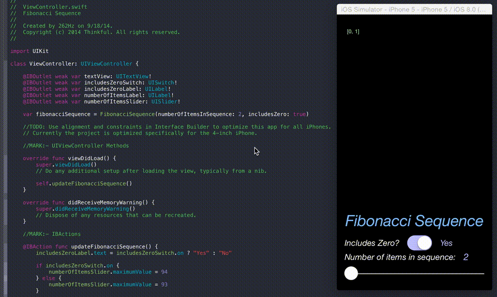

# Fibonacci Sequence

An implementation of the Fibonacci Sequence written in Swift for iOS 8.

By definition, the first two numbers in the Fibonacci sequence are 1 and 1, or 0 and 1, depending on the chosen starting point of the sequence, and each subsequent number is the sum of the previous two.

# Notes

This project is part of Thinkful's course [Intro to iOS Programming in Swift](http://thinkful.com)

Included are several Playgrounds and an iOS project.
